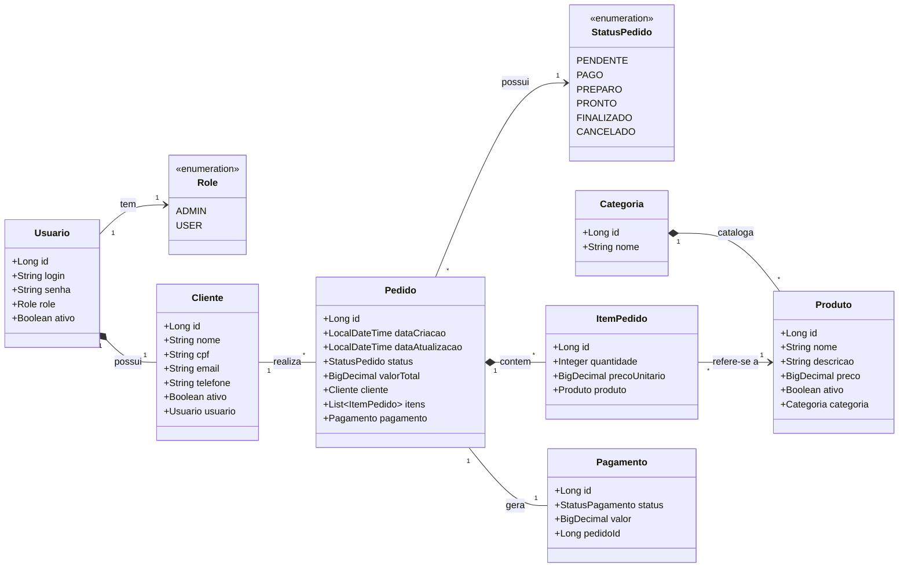

# 🍔 PedeAí - API de Catálogo e Pedidos de Alta Performance

O **PedeAí** é uma API REST robusta para gerenciamento de delivery, desenvolvida com foco em **escalabilidade**, **segurança** e **alta performance**. O projeto utiliza uma arquitetura moderna baseada em Java 21, cache distribuído e processamento assíncrono de eventos.

> 🖥️ **Aviso:** Este é o repositório do Backend. O Frontend em React (Backoffice e Cardápio) pode ser encontrado [aqui no repositório do Frontend](https://github.com/Marcos-Dant/pedeai-frontend).

---

## 🚀 Tecnologias Utilizadas

* **Core:** Java 21, Spring Boot.
* **Arquitetura:** Spring Modulith (Monólito Modular).
* **Banco de Dados:** MySQL 8.0, Spring Data JPA, Flyway (Migrações).
* **Cache & Performance:** Redis 7.0.
* **Mensageria:** RabbitMQ (AMQP).
* **Segurança:** Spring Security, JWT (JJWT), BCrypt.
* **Testes (QA):** JUnit 5, Mockito, **Testcontainers** (MySQL, Redis, RabbitMQ reais), Awaitility.
* **DevOps:** Docker Compose, GitHub Actions (CI/CD).
* **Documentação:** SpringDoc OpenAPI (Swagger UI).

---

## 🏛️ Arquitetura e Design

### 1. Modelo de Domínio (UML)
O sistema separa as credenciais de acesso (`Usuario`) dos dados de perfil (`Cliente`), garantindo flexibilidade e segurança. Abaixo, o diagrama de relacionamento das entidades principais atualizado:

✨ Funcionalidades Principais
Autenticação Segura: Login via Token JWT com controle de acesso rigoroso baseado em cargos (ROLE_ADMIN vs ROLE_USER).

Gestão de Cardápio e Backoffice: CRUD completo de produtos, categorias e clientes (Soft Delete) com invalidação inteligente de cache.

Monitor da Cozinha e Fluxo de Pedidos:

Cliente cria pedido (PENDENTE). Proteção contra mensagens duplicadas e loops de retentativa infinita, garantindo que um pedido nunca seja pago duas vezes.

Evento de pagamento enviado ao RabbitMQ.

Worker processa e atualiza para PAGO ou CANCELADO.

Controle rígido de transição de status no Monitor da Cozinha (PENDENTE ➔ PAGO ➔ PREPARO ➔ PRONTO ➔ FINALIZADO), impedindo avanços ilegais no fluxo.

Documentação Interativa: Swagger UI disponível para testes manuais.

⚙️ Como Rodar o Projeto
Pré-requisitos

Docker e Docker Compose instalados.

Java 21 (Opcional, caso use apenas Docker).

Passo a Passo:

Clone o repositório:

Bash
git clone [https://github.com/Marcos-Dant/PedeAi](https://github.com/Marcos-Dant/PedeAi)
cd pedeai
Suba a infraestrutura (MySQL, Redis, RabbitMQ): O projeto possui suporte ao spring-boot-docker-compose. Basta rodar a aplicação ou, se preferir subir manualmente:

Bash
docker compose up -d
Execute a aplicação:

Bash
./mvnw spring-boot:run
Acesse a Documentação: Abra o navegador em: http://localhost:8080/swagger-ui.html

🧪 Estratégia de Testes
O projeto adota uma pirâmide de testes sólida, com foco em testes de integração fidedignos.

Unitários: Regras de negócio isoladas com Mockito.

Integração (E2E): Utilizamos Testcontainers. Isso significa que, ao rodar mvn verify, o projeto sobe containers reais do MySQL, Redis e RabbitMQ descartáveis. Não usamos banco em memória (H2), garantindo que o teste reflita exatamente o ambiente de produção.

🔄 CI/CD
O projeto conta com um pipeline configurado no GitHub Actions que:

Faz o checkout do código.

Configura o JDK 21.

Sobe a infraestrutura via Testcontainers.

Executa a suíte de testes.

Garante que apenas código estável seja integrado à branch principal.# 🍔 PedeAí - API de Catálogo e Pedidos de Alta Performance

O **PedeAí** é uma API REST robusta para gerenciamento de delivery, desenvolvida com foco em **escalabilidade**, **segurança** e **alta performance**. O projeto utiliza uma arquitetura moderna baseada em Java 21, cache distribuído e processamento assíncrono de eventos.

> 🖥️ **Aviso:** Este é o repositório do Backend. O Frontend em React (Backoffice e Cardápio) pode ser encontrado [aqui no repositório do Frontend](https://github.com/Marcos-Dant/pedeai-frontend).

---

## 🚀 Tecnologias Utilizadas

* **Core:** Java 21, Spring Boot.
* **Arquitetura:** Spring Modulith (Monólito Modular).
* **Banco de Dados:** MySQL 8.0, Spring Data JPA, Flyway (Migrações).
* **Cache & Performance:** Redis 7.0.
* **Mensageria:** RabbitMQ (AMQP).
* **Segurança:** Spring Security, JWT (JJWT), BCrypt.
* **Testes (QA):** JUnit 5, Mockito, **Testcontainers** (MySQL, Redis, RabbitMQ reais), Awaitility.
* **DevOps:** Docker Compose, GitHub Actions (CI/CD).
* **Documentação:** SpringDoc OpenAPI (Swagger UI).

---

## 🏛️ Arquitetura e Design

### 1. Modelo de Domínio (UML)
O sistema separa as credenciais de acesso (`Usuario`) dos dados de perfil (`Cliente`), garantindo flexibilidade e segurança. Abaixo, o diagrama de relacionamento das entidades principais atualizado:

✨ Funcionalidades Principais
Autenticação Segura: Login via Token JWT com controle de acesso rigoroso baseado em cargos (ROLE_ADMIN vs ROLE_USER).

Gestão de Cardápio e Backoffice: CRUD completo de produtos, categorias e clientes (Soft Delete) com invalidação inteligente de cache.

Monitor da Cozinha e Fluxo de Pedidos:

Cliente cria pedido (PENDENTE). Proteção contra mensagens duplicadas e loops de retentativa infinita, garantindo que um pedido nunca seja pago duas vezes.

Evento de pagamento enviado ao RabbitMQ.

Worker processa e atualiza para PAGO ou CANCELADO.

Controle rígido de transição de status no Monitor da Cozinha (PENDENTE ➔ PAGO ➔ PREPARO ➔ PRONTO ➔ FINALIZADO), impedindo avanços ilegais no fluxo.

Documentação Interativa: Swagger UI disponível para testes manuais.

⚙️ Como Rodar o Projeto
Pré-requisitos

Docker e Docker Compose instalados.

Java 21 (Opcional, caso use apenas Docker).

Passo a Passo:

Clone o repositório:

Bash
git clone [https://github.com/Marcos-Dant/PedeAi](https://github.com/Marcos-Dant/PedeAi)
cd pedeai
Suba a infraestrutura (MySQL, Redis, RabbitMQ): O projeto possui suporte ao spring-boot-docker-compose. Basta rodar a aplicação ou, se preferir subir manualmente:

Bash
docker compose up -d
Execute a aplicação:

Bash
./mvnw spring-boot:run
Acesse a Documentação: Abra o navegador em: http://localhost:8080/swagger-ui.html

🧪 Estratégia de Testes
O projeto adota uma pirâmide de testes sólida, com foco em testes de integração fidedignos.

Unitários: Regras de negócio isoladas com Mockito.

Integração (E2E): Utilizamos Testcontainers. Isso significa que, ao rodar mvn verify, o projeto sobe containers reais do MySQL, Redis e RabbitMQ descartáveis. Não usamos banco em memória (H2), garantindo que o teste reflita exatamente o ambiente de produção.

🔄 CI/CD
O projeto conta com um pipeline configurado no GitHub Actions que:

Faz o checkout do código.

Configura o JDK 21.

Sobe a infraestrutura via Testcontainers.

Executa a suíte de testes.

Garante que apenas código estável seja integrado à branch principal.
